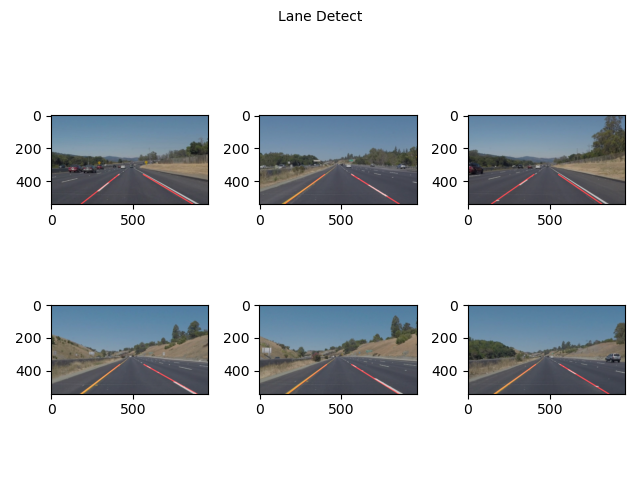
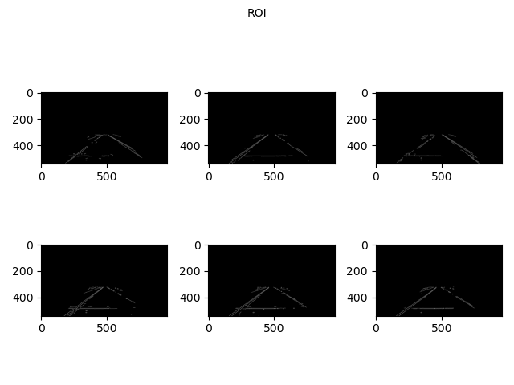
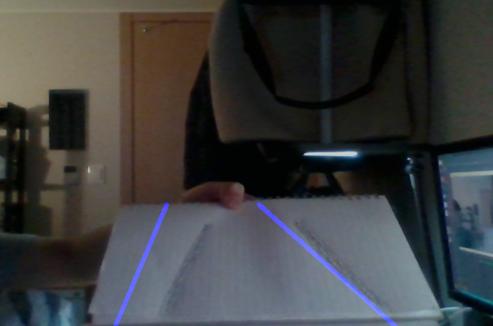

# Finding Lane Lines on the Road
> DATE: '21.3/5
> AUTHOR: SungwookLE(joker1251@naver.com)

## 1. INTRODUCTION
This project is for lane detection algorithm using OPENCV library.  
There are three files: `helper.py`, `lane_detect.py`, `real_detect.py`.  
Very simple to implement this functionality.

## 2. MAIN
### 2-1. useful functions in helper.py
```python
def grayscale(img):
    return cv2.cvtColor(img, cv2.COLOR_RGB2GRAY)
```
Using cv2.cvtColor, Converting color space to gray.

```python    
def canny(img, low_threshold, high_threshold):
    return cv2.Canny(img, low_threshold, high_threshold)
```
Canny function use gradient value to detect the shape of image pixels.

```python
def gaussian_blur(img, kernel_size):
    return cv2.GaussianBlur(img, (kernel_size, kernel_size), 0)
```
GaussianBlur makes image soft.

```python
def region_of_interest(img, vertices):
    #defining a blank mask to start with
    mask = np.zeros_like(img)   
    
    if len(img.shape) > 2:
        channel_count = img.shape[2] # i.e. 3 or 4 depending on your image
        ignore_mask_color = (255,) * channel_count
    else:
        ignore_mask_color = 255

    cv2.fillPoly(mask, [vertices], ignore_mask_color)
    
    #returning the image only where mask pixels are nonzero
    masked_image = cv2.bitwise_and(img, mask)
    return masked_image
```
ROI skill is important to process image. It crop the image. First tep is makes poly shpae and using `bitwise_and` returning the image only where mask pixels are nonzero.

```python
def draw_lines(img, lines, color=[255, 0, 0], thickness=5):
    
    x_len = img.shape[1]
    y_len = img.shape[0]

    left  =[]
    right =[]

    if lines is not None:
        for line in lines:
            for x1,y1,x2,y2 in line:
                k = ((y2-y1)/(x2-x1))

                if ((k< -0.5) and (k >-15)):
                    left.append([k,x1,y1,x2,y2])
                elif ((k > 0.5)  and ( k < 15)):
                    right.append([k,x1,y1,x2,y2])

        if len(left)>0 :
                left = np.array(left)
                x_left = int(np.mean(left[:,1]))
                y_left = int(np.mean(left[:,2]))
                k_left = np.mean(left[:,0])
                b_left = y_left -k_left * x_left

                if (abs(k_left) > 0.1):
                    cv2.line(img, (int(1/k_left*(y_len-b_left)) , y_len), (int( 1/k_left*(y_len//2+y_len//6-b_left)) ,y_len//2+y_len//6), color, thickness)

        if len(right)>0 :
                right = np.array(right)
                x_right = int(np.mean(right[:,1]))
                y_right = int(np.mean(right[:,2]))
                k_right= np.mean(right[:,0])
                b_right = y_right - k_right*x_right

                if (abs(k_right)>0.1):
                    cv2.line(img, (int(1/k_right*(y_len-b_right)) , y_len), (int( 1/k_right*(y_len//2+y_len//6-b_right)) ,y_len//2+y_len//6), color, thickness)
```
**This function is the key code of this project. Make this whole detecting processing robust, Linear Lane model was suggested as `y=ax+b`. Each left and right lane's linear model coefficients were calculated.**

```python
def hough_lines(img, rho, theta, threshold, min_line_len, max_line_gap):
    
    lines = cv2.HoughLinesP(img, rho, theta, threshold, np.array([]), minLineLength=min_line_len, maxLineGap=max_line_gap)
    line_img = np.zeros((img.shape[0], img.shape[1], 3), dtype=np.uint8)
    draw_lines(line_img, lines)
    return line_img
```
`HoughLinesP` is the opencv member that make find line as [WIKI](https://en.wikipedia.org/wiki/Hough_transform).  


```python
def weighted_img(img, initial_img, α=0.8, β=1., γ=0.):
    """
    initial_img * α + img * β + γ
    NOTE: initial_img and img must be the same shape!
    """
    return cv2.addWeighted(initial_img, α, img, β, γ)
```
`cv2.addWeighted` member was used for visualization.  

### 2-2. `process_image(image, mode='off')` in lane_detect.py
Using defined helpers function, the whole detect processing was implemented as follow.  

|STEPS|
|:--|
|step1. cvtColor to gray|
|(option) step. equalizeHist|
|step2. gaussian blur|
|step3. Canny|
|step4. ROI|
|step5. HoughLine|
|step6. Visualizing|
||


```python
import cv2
from helper import *

def process_image(image, mode='off'):
    x_len = image.shape[1]
    y_len = image.shape[0]

    img = image.copy()
    
    # step 1. cvtColor(img, cv2.COLOR_RGB2GRAY)
    gray = grayscale(img)

    # (option) step. equalizeHist
    equ = cv2.equalizeHist(gray)

    # step 2. gaussian blue (if needed,)
    blur = gaussian_blur(equ, 7)

    # step 3. Canny(img, low_threshold, high_threshold)
    canny_img=canny(blur, 50, 100)

    # step 4. region_of_interest
    x_off = 150
    trapezoidal_x_off = 220
    y_off = 320
    region = np.array([[x_off+trapezoidal_x_off, y_off], [x_len-x_off-trapezoidal_x_off,y_off], [x_len-x_off, y_len] , [x_off,y_len]], np.int32)
    roi = region_of_interest(canny_img, region)

    # step 5. HoughLinesP(img, rho, theta, threshold, np.array([]), minLineLength=min_line_len, maxLineGap=max_line_gap)
    hough_img=hough_lines(roi, 1, np.pi/180, 45, 25, 3)

    # step 6. visualizaing with addWeighted
    res=weighted_img(hough_img, image)

    if mode == 'off':
        return res, roi
    elif mode == 'real':
        return res
    else:
        return res,roi
```

### 2-3. TESTING function in `lane_detect.py, real_detect.py`

```python
# IMAGE
images = os.listdir("test_images/")
fig , ax = plt.subplots(2,len(images)//2)
fig.suptitle('Lane Detect', fontsize=10)

fig2 , ax2 = plt.subplots(2,len(images)//2)
fig2.suptitle('ROI', fontsize=10)

idx =0
for img in images:
    #reading in an image
    pick_img = mpimg.imread("test_images/"+img)
    print('This image is:', type(pick_img), 'with dimensions:', pick_img.shape)
    test,roi=process_image(pick_img,'off')

    ax[idx%2,idx//2].imshow(test)
    ax2[idx%2,idx//2].imshow(roi, cmap='gray')
    idx+=1

fig.tight_layout()
fig2.tight_layout()

fig.savefig("./test_images_output/LaneDetect.png")
fig2.savefig("./test_images_output/ROI.png")
plt.show()

#VIDEO SAVE
white_output = 'test_videos_output/solidWhiteRight.mp4'
##clip1 = VideoFileClip("test_videos/solidWhiteRight.mp4").subclip(0,5)
clip1 = VideoFileClip("test_videos/solidWhiteRight.mp4")
white_clip = clip1.fl_image(process_image) #NOTE: this function expects color images!!
white_clip.write_videofile(white_output, audio=False)

yellow_output = 'test_videos_output/solidYellowLeft.mp4'
##clip2 = VideoFileClip('test_videos/solidYellowLeft.mp4').subclip(0,5)
clip2 = VideoFileClip('test_videos/solidYellowLeft.mp4')
yellow_clip = clip2.fl_image(process_image)
yellow_clip.write_videofile(yellow_output, audio=False)

challenge_output = 'test_videos_output/challenge.mp4'
##clip3 = VideoFileClip('test_videos/challenge.mp4').subclip(0,5)
clip3 = VideoFileClip('test_videos/challenge.mp4')
challenge_clip = clip3.fl_image(process_image)
challenge_clip.write_videofile(challenge_output, audio=False)
```

Also using `cv2.videoCapture(0)`.
```python

cap = cv2.VideoCapture(0)
print(cap.get(cv2.CAP_PROP_FRAME_WIDTH), cap.get(cv2.CAP_PROP_FRAME_HEIGHT))

while(cap.isOpened()):
        ret, frame = cap.read()
        frame = cv2.resize(frame, dsize=(960,540))
        print(frame.shape)
        out=process_image(frame,'real')
        cv2.imshow('out',out)
        if cv2.waitKey(1) & 0xFF == ord('q'):
            break

cap.release()
cv2.destroyAllWindows()    
```

Testing using inner webcam.

## 3. CONCLUSION

### 3-1 Images results



### 3-2 Video results
[](./test_videos_output/solidWhiteRight.mp4)
[video2](./test_videos_output/solidYellowLeft.mp4)  
[video3](./test_videos_output/challenge.mp4)  

**End.**